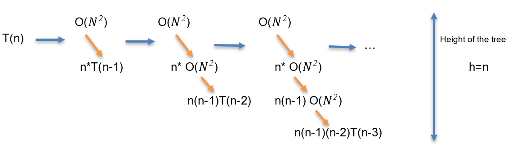

Time Complexity Analysis:

We will discuss in this section the time complexity of the code above of N Queens Backtracking Algorithm.

Let N be the number of total queens, n the number of left queens and N-n thus, the number of already placed queens.

First, Let’s find the number of all possible arrangements of n Queens on n*n chessboard without satisfying the special conditions.
This means we will go through every position n for every queen n, which results in N^Narrangements. 
This gives the brute force solution without using backtracking. 

However, the backtracking approach reduces the time complexity to: O(n!) because it eliminates dead ends.
In the given code, the main program calls the function queen(n) which calls the function place(k).
The function place(k) checks the already placed queens. So it has O(N-n) worst case running time. 
Since O(N-n)<O(N), we can write O(N-n)=O(N)  
Since the function queen iterates n times and for each iteration it calls the function place(row) function the total time complexity would be O(N^2).

Besides, queen(k,n) is a recursive function. 
Thus, the recursive call of T(n-1) will run n times  because it will run only for the safe cells. Since we have started by filling up the rows, there won't be more than n (number of queens left) safe cells in the row in any case. Which in turn results in n*T(n-1) times.
By adding the results above we get T(n)= n*T(n-1) + O(N^2)
By recursion Tree:

Replacing T(n−1) with O(N^2)+(n−1)T(n−2):

T(n) = O(N^2)+n∗(O(N^2)+(n−1)T(n−2))T(n) 
= O(N^2)+n∗(O(N^2)+(n−1)T(n−2))
=O(N^2)+nO(N^2)+n(n−1)T(n−2)

Replacing T(n−2) with O(N^2)+(n−2)T(n−3):

T(n)=O(N^2)+nO(N^2)+n(n−1)(O(N^2)+(n−2)T(n−3))T(n)
=O(N^2)+nO(N^2)+n(n−1)(O(N^2)+(n−2)T(n−3))
=O(N^2)+nO(N^2)+n(n−1)O(N^2)+n(n−1)(n−2)T(n−3)

Similarly:

T(n)=O(N^2)(1+n+n(n−1)+n(n−2)+...)+n∗(n−1)∗(n−2)∗(n−3)∗(n−4)∗....∗T(0)T(n)
=O(N^2)(1+n+n(n−1)+n(n−2)+...)+n∗(n−1)∗(n−2)∗(n−3)∗(n−4)∗....∗T(0)T(n)
=O(N^2)(O((n−2)!))+n∗(n−1)∗(n−2)∗(n−3)∗....∗T(0)T(n)
=O(N^2)(O((n−2)!))+n∗(n−1)∗(n−2)∗(n−3)∗....∗T(0)
=O(N^2)(O((n−2)!))+O(n!)= O(n!)  According to the definition of Big-Oh notation

So we can conclude that the time complexity of N Queens Algorithm is O(n!)
