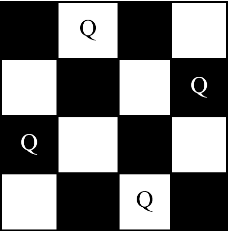

# N-Queens

A classic example of backtracking algorithms is “N Queens Problem”. It was first introduced in 1848 with N = 8 Queens. The first solution was proposed in 1850 by Franz Nauck. Since then, this 8 Queens puzzle and its generalized N-Queen version have attracted more researchers to develop better and optimized solutions.Here, we will go through the working principle of backtracking in solving this problem and  its implementation in C language. We will also analyze its time complexity (Big O notation). 
The N Queen Algorithm searches for a safe arrangement of N chess queen on a chessboard with N*N dimensions  such that no queen attacks any other. A queen is in danger if it is in the same line or column or diagonal with another queen. This means every queen should be placed in a unique row and unique column with paying attention to the diagonals
 Here is an example of 4*4 Chessboard with a safe arrangement of 4 Queens: 
 

Starting by the first queen, we place queens one by one by incrementing the number of lines. One of the approaches to solve this problem can be presented as follows:
1.	Place the first queen in the first row and leftmost column of the chessboard
2.	Move to the next queen (ie to the next row).
3.	Search for a valid position. If there is one go to step 6.
4.	Else move to the previous queen to change its position.
5.	Go to step 3.
6.	Place it to the first valid position.
7.	If this queen is the last output the solution and stop otherwise go to step 2.

